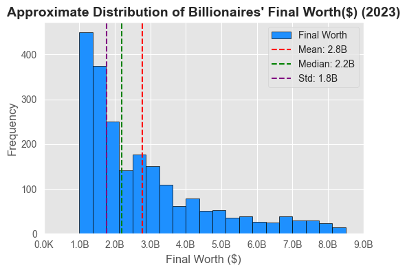
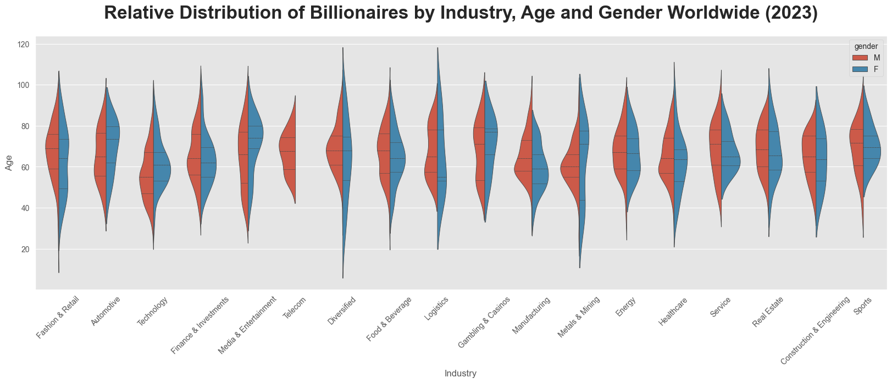

# Billionaires Statistics

## Table of Contents

- **[Getting Started](#getting_started)** <br>
- **[Introduction](#introduction)** <br>
- **[Objectives of the Analysis](#analysis_objectives)** <br>
- **[Scope of the Analysis](#analysis_scope)** <br>
- **[Results](#results)** <br>
- **[Data Source and Acknowledgments](#data_source)** <br>
- **[Sample Visualizations](#sample_visuals)** <br>
- **[License](#license)** <br> 

<a id="getting_started"></a>
## Getting Started 
To get started with this project, follow the steps below:

### Prerequisites

Ensure you have the following installed on your local machine:

- Python (3.9)
- Jupyter Notebook

### Configuration

1. Clone the repository to your local machine:

   ```bash
   git clone https://github.com/Nazgul773/billionaires_statistics.git

2. Install the required Python packages in your virtual environment:
   ```bash
   pip install pandas
   ```
   ``` bash
   pip install seaborn
   ```
   
   <br>
<a id="introduction"></a>
## Introduction 
Embark on a comprehensive journey into the world of global billionaires through a two-step process. In the initial phase, the dataset undergoes rigorous cleaning, focusing on standardizing column names, handling missing data, addressing duplicates, and managing outliers. This ensures the dataset's accuracy and reliability for subsequent analysis. The refined dataset is then stored for further exploration in the second step, where an in-depth Exploratory Data Analysis (EDA) unfolds.

<a id="analysis_objectives"></a>
## Objectives of the Analysis
This EDA project aims to unveil patterns in demographics, examine wealth distribution across countries/cities, and explore correlations between economic indicators and the billionaire landscape. Specific aspects like age distribution, wealth sources, regional patterns, and industry trends will be thoroughly investigated.

<a id="analysis_scope"></a>
## Scope of the Analysis
The analysis will delve into comprehensive information about notable billionaires worldwide, encompassing details such as their ranking based on final net worth, industry category, personal attributes, country of residence, and various economic indicators for the countries they are associated with.

<a id="results"></a>
## Results
- Demographic patterns and age distribution insights.
- Wealth distribution across countries/cities.
- Correlations between economic indicators and the billionaire landscape.
- Notable industry trends among billionaires.

<a id="data_source"></a>
## Data Source and Acknowledgments

The dataset for this analytics project is sourced from [Kaggle](https://www.kaggle.com/datasets/nelgiriyewithana/billionaires-statistics-dataset) from the year 2023, providing a rich resource for in-depth analysis of wealth distribution and socioeconomic factors.

### Acknowledgments

Special thanks to [Kaggle](https://www.kaggle.com) for providing the dataset, as well as:

- [Pandas](https://pandas.pydata.org/) for its powerful data manipulation capabilities, and
- [Seaborn](https://seaborn.pydata.org/) for its contribution to insightful data visualization.

These tools have been invaluable in conducting a thorough exploratory data analysis and deriving meaningful insights from the billionaire statistics dataset.

<a id="sample_visuals"></a>
## Sample Visualizations




<a id="license"></a>
## License
This Project is [MIT](LICENSE) licensed.
