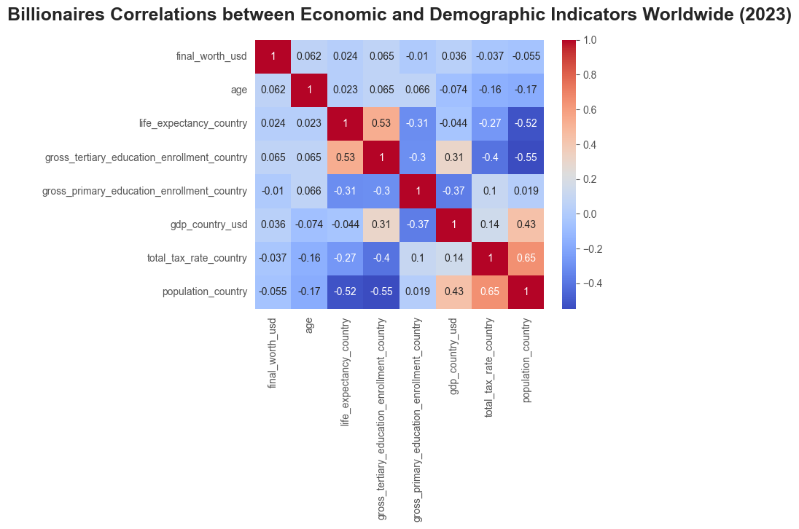

# Billionaires Statistics

## Table of Contents

- **[Getting Started](#getting_started)** <br>
- **[Introduction](#introduction)** <br>
- **[Objectives of the Analysis](#analysis_objectives)** <br>
- **[Scope of the Analysis](#analysis_scope)** <br>
- **[Data Source and Acknowledgments](#data_source)** <br>
- **[Results](#results)** <br>
- **[Sample Visualizations](#sample_visuals)** <br>
- **[License](#license)** <br> 

<a id="getting_started"></a>
## Getting Started 
To get started with this project, follow the steps below:

### Prerequisites

Ensure you have the following installed on your local machine:

- [Python](https://www.python.org/downloads/release/python-390/) (version 3.9 recommended)
- [Jupyter Notebook](https://jupyter.org/)

### Configuration

1. Clone the repository to your local machine:

   ```bash
   git clone https://github.com/Nazgul773/billionaires_statistics.git

2. Set up a virtual environment (optional but recommended):
   ```bash
   # Create a virtual environment
   python -m venv venv
   ```
   ```bash
   # Activate the virtual environment
   source venv/bin/activate   # For Linux/macOS
   ```
   ```bash
   .\venv\Scripts\activate    # For Windows
   ```
3. Install the required Python packages:
   ```bash
   pip install pandas
   ```
   ``` bash
   pip install seaborn
   ```
4. Launch the Notebook:
   ``` bash
   jupyter notebook billionaires_statistics.ipynb
   ```
<a id="introduction"></a>
## Introduction 
Embark on a comprehensive journey into the world of global billionaires through a two-step process. In the initial phase, the dataset undergoes rigorous cleaning, focusing on standardizing column names, handling missing data, addressing duplicates, and managing outliers. This ensures the dataset's accuracy and reliability for subsequent analysis. The refined dataset is then stored for further exploration in the second step, where an in-depth Exploratory Data Analysis (EDA) unfolds.

<a id="analysis_objectives"></a>
## Objectives of the Analysis
This EDA project aims to unveil patterns in demographics, examine wealth distribution across countries/cities, and explore correlations between economic indicators and the billionaire landscape. Specific aspects like age distribution, wealth sources, regional patterns, and industry trends will be thoroughly investigated.

<a id="analysis_scope"></a>
## Scope of the Analysis
The analysis will delve into comprehensive information about notable billionaires worldwide, encompassing details such as their ranking based on final net worth, industry category, personal attributes, country of residence, and various economic indicators for the countries they are associated with.

<a id="data_source"></a>
## Data Source and Acknowledgments

The dataset for this analytics project is sourced from [Kaggle](https://www.kaggle.com/datasets/nelgiriyewithana/billionaires-statistics-dataset) from the year 2023, providing a rich resource for in-depth analysis of wealth distribution and socioeconomic factors.

### Acknowledgments

Special thanks to [Kaggle](https://www.kaggle.com) for providing the dataset, as well as:

- [Pandas](https://pandas.pydata.org/) for its powerful data manipulation capabilities, and
- [Seaborn](https://seaborn.pydata.org/) for its contribution to insightful data visualization.

These tools have been invaluable in conducting a thorough exploratory data analysis and deriving meaningful insights from the billionaire statistics dataset.

<a id="results"></a>
## Results 
### Wealth Distribution
- The dataset comprises 2,384 billionaires with a mean net worth of approximately $4.77 billion, ranging from $1 billion to $211 billion.
- The top 5 industries dominating the billionaire landscape are Finance & Investments, Technology, Manufacturing, Fashion & Retail, and Healthcare, collectively representing around 56.38% of the total billionaires.

### Demographics
- Age Distribution: The age of billionaires ranges from 18 to 101 years, with a mean age of 64.99 years. The majority fall within the 56 to 74 age range.
- Gender Disparity: Male billionaires significantly outnumber female billionaires, constituting approximately 88.21% of the total billionaires.

### Self-Made Success
- The majority of billionaires are self-made, representing approximately 70.42% of the total billionaires.

### Top 5 Countries and Wealth Source Distribution
- The United States, China, India, Germany, and Russia are notable countries in terms of billionaire count.
  - In the United States, 537 billionaires are self-made, while 213 inherited their wealth.
  - China has 489 self-made billionaires and 15 with inherited wealth.
  - India, Germany, and Russia also showcase varying patterns of inherited and self-made billionaires.

### Correlation Analysis
- Net worth shows positive correlations with tertiary education enrollment and age, while it has negative correlations with country population and total tax rate.
- Age exhibits negative correlations with country population and total tax rate.
- Life expectancy in a country correlates positively with gross tertiary education enrollment and negatively with country population and total tax rate.
- Gross tertiary education enrollment shows positive correlations with GDP and negative correlations with country population and total tax rate.

<a id="sample_visuals"></a>
## Sample Visualizations




<a id="license"></a>
## License
This Project is [MIT](LICENSE) licensed.
